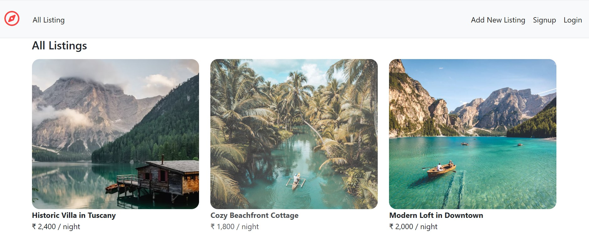
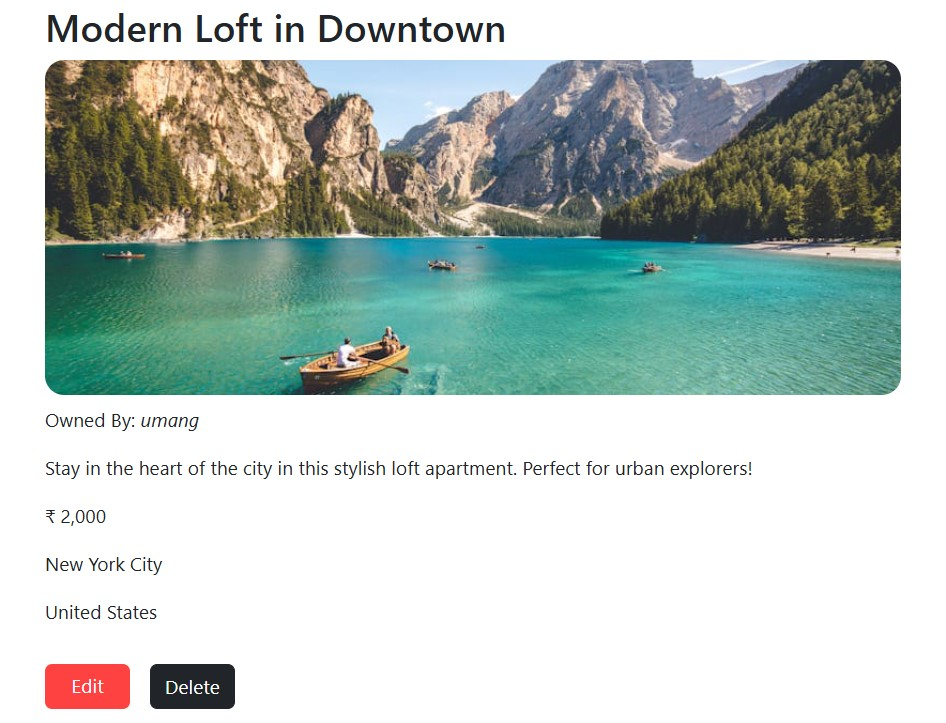
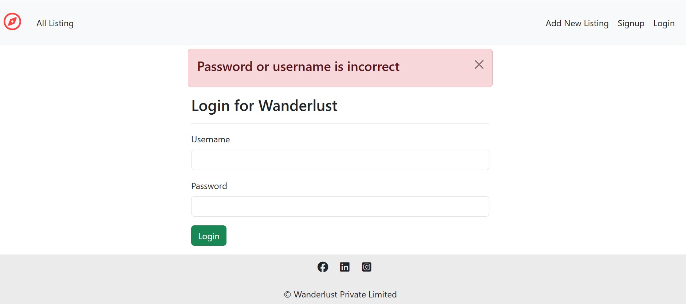
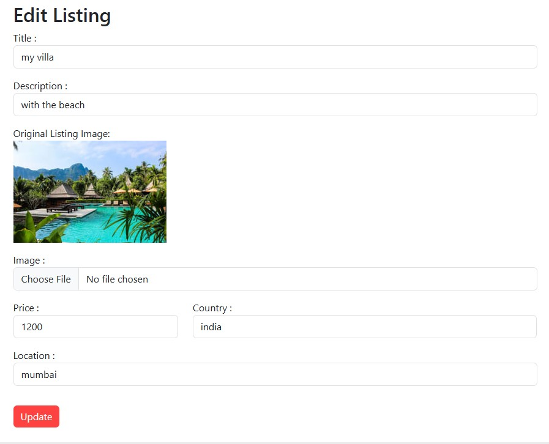

# 🌍 WanderLust — Travel Booking & Listing Website

 
 
 
 
  

---

## ✨ Project Overview
**WanderLust** is a **full-stack travel booking and listing platform** where users can explore, list, and manage travel destinations.  
It’s built with the **MVC architecture** for clean structure and scalability.  

🚀 **Live Demo:** [WanderLust Website](https://wanderlust-unhh.onrender.com/listings)

---

## 🛠 Tech Stack

| Category           | Technologies Used |
|--------------------|-------------------|
| **Frontend**       | HTML5, CSS3, JavaScript, Bootstrap |
| **Backend**        | Node.js, Express.js |
| **Database**       | MongoDB Atlas |
| **Template Engine**| EJS, EJS-Mate |
| **Authentication** | Passport.js, Passport-Local, Passport-Local-Mongoose |
| **File Uploads**   | Multer, Multer-Storage-Cloudinary |
| **Image Hosting**  | Cloudinary |
| **Data Validation**| Joi |
| **Session Handling**| Express-Session, Connect-Mongo, Connect-Flash |
| **Environment Config** | Dotenv |
| **HTTP Utilities** | Method-Override |
| **Deployment**     | Render |

---

## 📌 Features
- 🏝 **Browse Listings** — Explore various travel destinations.
- 📝 **Add & Edit Listings** — Users can create and manage their own listings.
- 🖼 **Image Uploads** — Support for multiple images per listing.
- ⚡ **Fast Performance** — Optimized queries & clean routing.
- 💻 **Responsive Design** — Fully optimized for **desktop**.  
> 🚧 **Mobile responsiveness** is currently under development.  
> ✨ Upcoming features:  
> - 🗺️ Interactive maps  
> - 🔍 Search bar  
> - 🎯 Advanced filters  
> - 🧭 Enhanced navigation bar with icons  

---

## My Project Screenshots

### 1️⃣ Index Page

### 2️⃣ Sign Up

### 3️⃣ Flash Message

### 4️⃣ Edit Page

### 5️⃣ Review Page

---

## 👨‍💻 Author
**Umang Dubey**  
💼 GitHub: [@Umangd29](https://github.com/Umangd29)  
📧 Email: [umangdubey1229](umangdubey1229@gmail.com) 
💼 LinkedIn: [Your LinkedIn Link](https://www.linkedin.com/in/umangdubey29)

---

### 💖 Support & Contribution
If you like this project, please ⭐ it on GitHub and share it!  
PRs and suggestions are always welcome.

---
